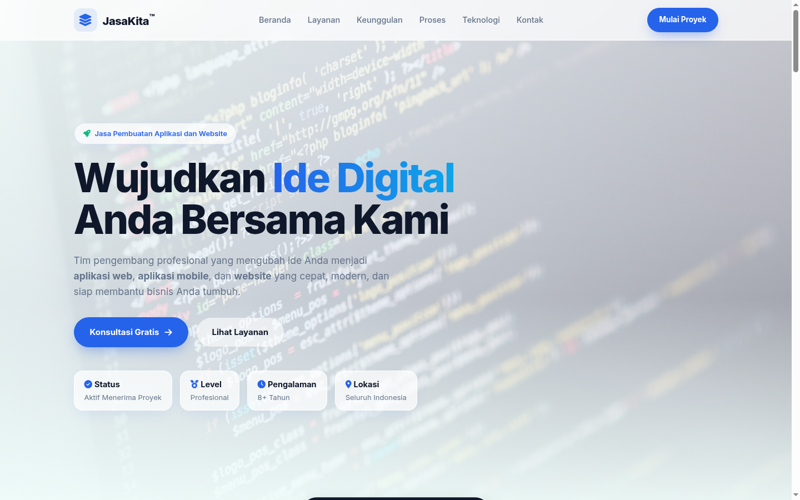
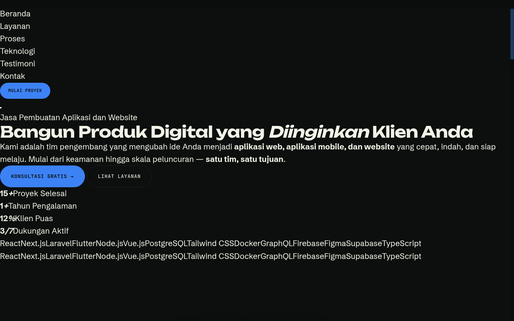

# JasaKita — Jasa Pembuatan Aplikasi dan Website


Website landing page profesional untuk **jasa pembuatan aplikasi dan website** milik **JasaKita**. Dibangun dengan HTML, CSS, dan JavaScript murni — tanpa framework — dengan desain gelap premium beraksen hijau limau yang modern dan responsif.

---

## ✨ Fitur

- **Sticky navbar** dengan efek blur dan menu hamburger mobile
- **Hero section** — headline bergaya stroke outline, tagline, CTA, dan statistik dengan animasi counter
  - 120+ proyek selesai
  - 8+ tahun pengalaman
  - 98% klien puas
  - 24/7 dukungan aktif
- **Marquee teknologi** berjalan (React, Next.js, Laravel, Flutter, dll.)
- **6 layanan** dalam layout bento grid:
  - Website Company Profile
  - Aplikasi Web
  - Aplikasi Mobile
  - Desain UI/UX
  - E-Commerce dan Marketplace
  - Maintenance dan Support
- **4 langkah proses** pengerjaan: Discovery → Desain → Pengembangan → Peluncuran
- **8 teknologi** pilihan: Frontend, Backend, Mobile, Database, Deploy, Integrasi, Desain, Analitik
- **3 testimoni** klien
- **CTA banner** ajakan wujudkan ide dalam 30 hari
- **Form kontak** dengan dropdown jenis proyek dan notifikasi toast
- **Footer** lengkap: navigasi, link perusahaan, legal, dan hak cipta
- **Custom cursor**, efek grain/texture, grid pattern, dan animasi reveal on-scroll
- **Fully responsive** — mobile, tablet, dan desktop

---

## 🛠️ Teknologi

| Area | Teknologi |
|---|---|
| Frontend | React · Next.js |
| Backend | Laravel · Node.js |
| Mobile | Flutter · React Native |
| Database | PostgreSQL · MySQL |
| Deploy | Docker · AWS · Vercel |
| Integrasi | Midtrans · Xendit · WhatsApp |
| Desain | Figma · Framer |
| Analitik | GA4 · Mixpanel · Hotjar |

---

## 🖼️ Screenshot

| Tampilan Hero | Tampilan Kontak |
|---|---|
|  |  |

---

## 🚀 Cara Menjalankan

### Lokal (via Python HTTP Server)

```bash
python3 -m http.server 8099
```

Lalu buka **http://localhost:8099/** di browser.

Atau cukup buka file `index.html` langsung di browser — semua aset sudah inline/terhubung lokal.

> **Catatan**: Gunakan server lokal agar file `script.js` termuat dengan benar (beberapa browser memblokir JavaScript saat dibuka via `file://`).

---

## 📁 Struktur Proyek

```text
.
├── index.html          # Halaman utama (semua CSS inline di <style>)
├── script.js            # JavaScript eksternal (interaktivitas)
├── preview-hero.png    # Screenshot tampilan hero
├── preview-kontak.png  # Screenshot tampilan kontak
├── README.md           # Dokumentasi ini
└── AGENTS.md           # Catatan teknis untuk agen AI
```

---

## 🎨 Desain

- **Tema**: Gelap premium `#0a0d0b` dengan aksen hijau limau `#c8f542`
- **Tipografi**:
  - *Unbounded* — heading display
  - *Schibsted Grotesk* — teks deskripsi
  - - *JetBrains Mono* — label, tombol, dan detail teknis
- **Detail visual**: noise texture (grain), grid pattern latar, radial glow, custom cursor, badge/eyebrow mono uppercase

---

## ⚙️ Fitur JavaScript (`script.js`)

- Custom cursor (dot + trailing ring) dengan efek hover pada elemen interaktif
- Navbar berubah saat scroll (efek blur + border bottom)
- Menu mobile hamburger dengan animasi ikon
- Marquee teknologi di-duplikasi agar loop mulus
- Animasi reveal on-scroll via IntersectionObserver
- Counter statistik animasi saat terlihat di viewport
- Validasi dan toast notifikasi pada form kontak

---

## 📬 Kontak

Ingin membuat aplikasi atau website? Silakan hubungi kami via form di website atau:

- **Email**: `halo@jasakita.id`
- **WhatsApp**: `+62 812-3456-7890`
- **Kantor**: Jl. Teknologi No. 17, Bandung, Jawa Barat

---

## 📄 Lisensi

© 2026 JasaKita. Seluruh hak cipta dilindungi. Seluruh konten dan desain dalam repositori ini adalah milik **JasaKita** dan tidak boleh digunakan ulang tanpa izin tertulis.